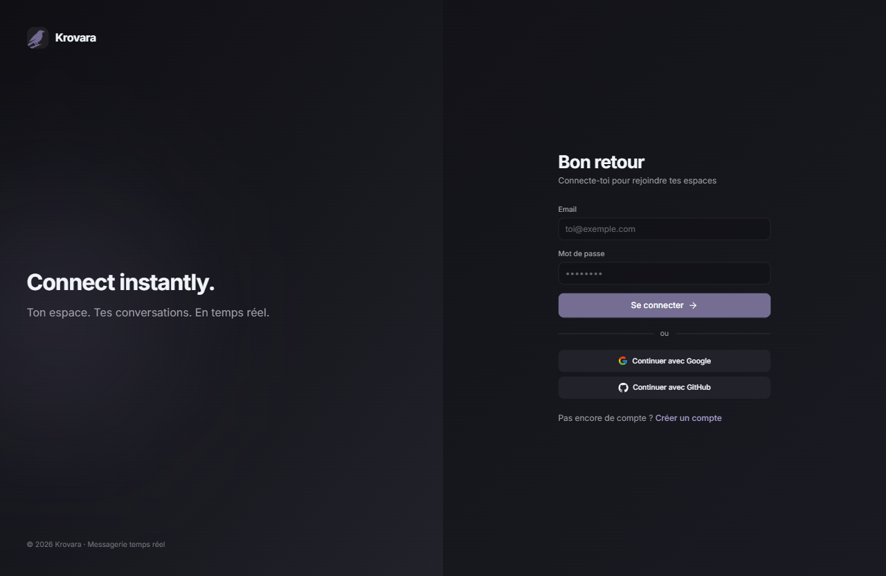
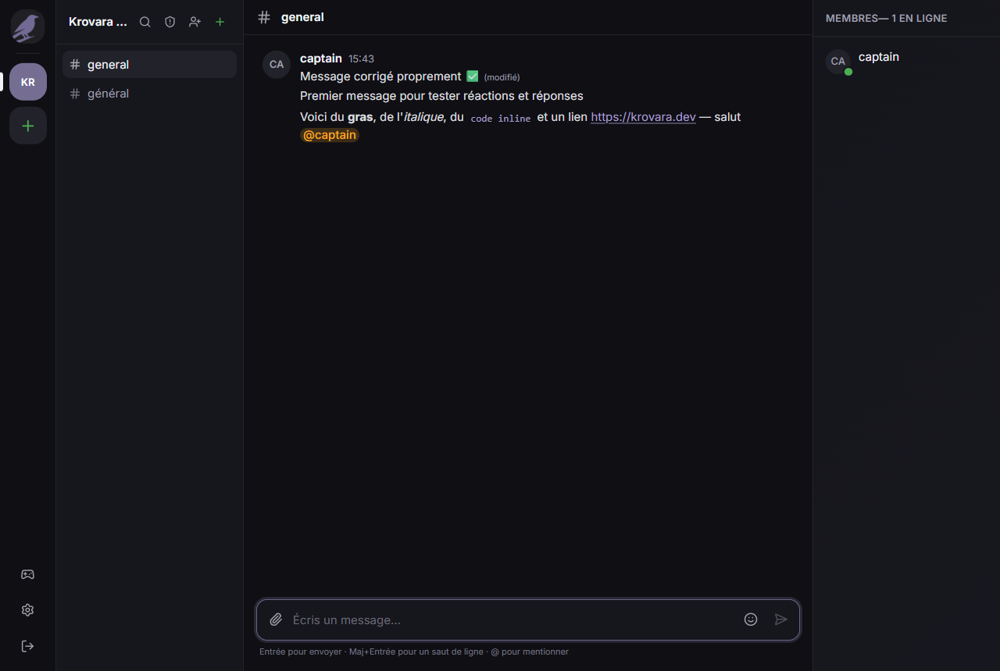
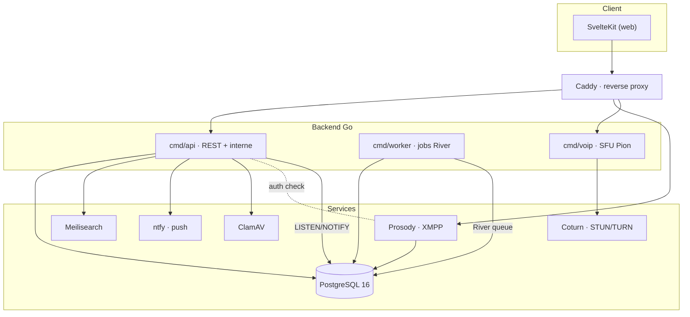
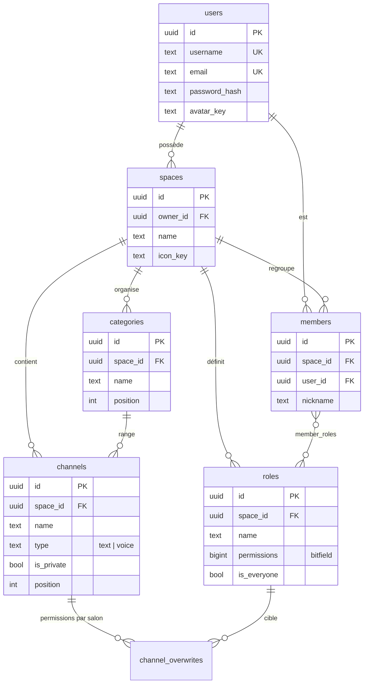
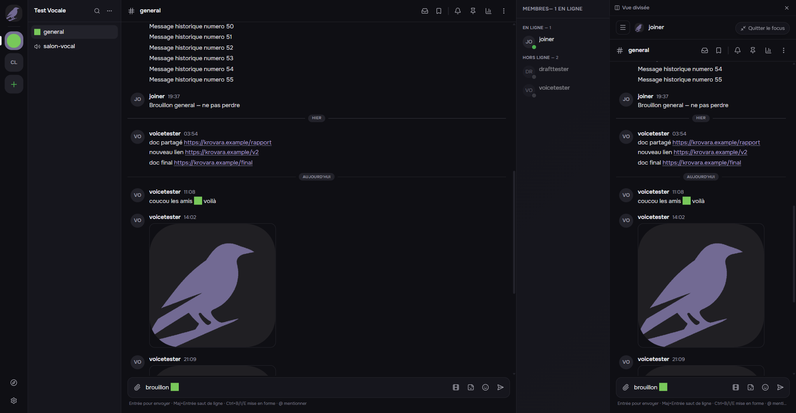
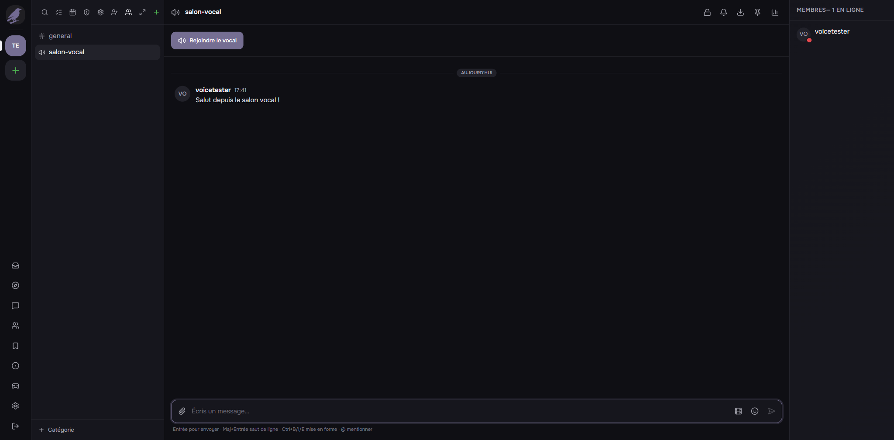
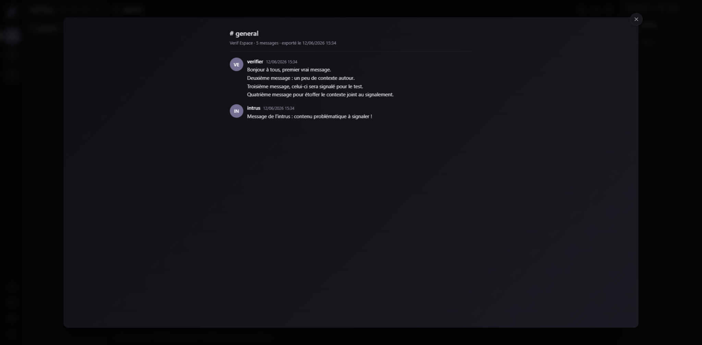
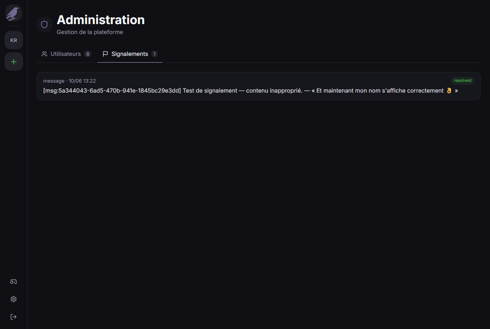
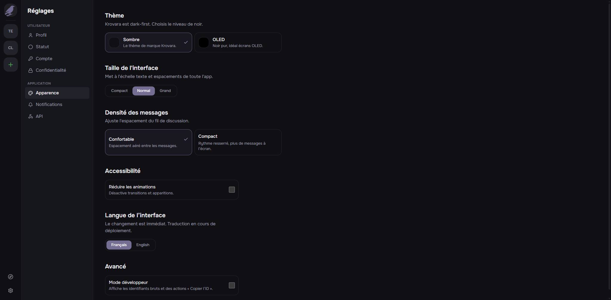

<div align="center">


# Krovara

**Plateforme de communication temps réel — chat, vocal et communautés.**
Messagerie fédérée XMPP, VoIP maison, API Go.

[](https://go.dev)
[](https://svelte.dev)
[](https://www.postgresql.org)
[](https://prosody.im)
[](https://www.docker.com)

</div>

<div align="center">
  
</div>

---

## Sommaire

- [C'est quoi](#cest-quoi)
- [Fonctionnalités](#fonctionnalités)
- [Stack technique](#stack-technique)
- [Architecture](#architecture)
- [Schéma de la base](#schéma-de-la-base)
- [Démarrage rapide](#démarrage-rapide)
- [Structure du projet](#structure-du-projet)
- [Tests](#tests)
- [Aperçu](#aperçu)

---

## C'est quoi

Krovara est une plateforme de communication façon Discord, construite sur des
standards ouverts plutôt que sur un protocole propriétaire :

- **Le chat passe par XMPP** (Prosody + WebSocket RFC 7395). Les messages de
  salon ne sont pas stockés dans une table SQL maison — ils vivent dans
  l'archive du serveur XMPP (MAM). Postgres ne garde que les *métadonnées*
  plateforme : espaces, salons, membres, rôles, permissions.
- **Le vocal est maison** (Pion, SFU en Go) avec STUN/TURN via Coturn et
  signalisation Jingle.
- **L'API est en Go** (chi + pgx + sqlc), avec des jobs asynchrones gérés par
  River (natif Postgres, pas de Redis).

L'ensemble tourne sous Docker Compose derrière Caddy.

---

## Fonctionnalités

### Communautés & salons
- Espaces (serveurs) avec salons texte et vocaux, organisés en catégories
- Rôles avec permissions par bitfield, overwrites par salon
- Invitations, formulaires d'admission, file de validation
- Découverte publique d'espaces

### Messagerie
- Temps réel via XMPP, historique paginé (MAM)
- Markdown (gras, italique, code, liens, spoilers), mentions, réponses
- Réactions emoji, emojis et stickers personnalisés
- Épingles, messages sauvegardés, fils de discussion
- Pièces jointes (images, audio, galeries, lightbox), GIF, prévisualisation de liens
- Édition avec historique, suppression, séparateurs de date, repère « non lus »

<div align="center">
  
</div>

### Vocal
- Salons vocaux avec chat texte intégré, appel en bannière
- SFU maison (Pion), STUN/TURN (Coturn), signalisation Jingle

### Messages privés
- DM 1:1 et groupes de DM (image de groupe, renommage live)

### Modération & sécurité
- Signalements avec contexte, file de modération, bannissements temporisés
- Administration plateforme (utilisateurs, signalements)
- Auth OAuth2 maison (Google, GitHub), JWT court + refresh tournant
- Captcha (Turnstile), rate-limiting, scan antivirus des fichiers (ClamAV),
  scan de liens malveillants (URLhaus + Google Safe Browsing)
- Anti double-compte (empreinte d'IP d'inscription), karma anti-spam
- Export RGPD des données, verrouillage de compte

### Confort
- Recherche full-text (Meilisearch), notifications push (ntfy)
- Thèmes (Sombre / OLED), densité, taille d'interface, FR/EN
- Bots, webhooks, jetons d'API, événements avec RSVP, sondages

---

## Stack technique

| Couche | Techno |
|--------|--------|
| API | Go · [chi](https://github.com/go-chi/chi) · [pgx](https://github.com/jackc/pgx) · [sqlc](https://sqlc.dev) |
| Base de données | PostgreSQL 16 (pub/sub via `LISTEN`/`NOTIFY`) |
| Messagerie | [Prosody](https://prosody.im) XMPP (WebSocket RFC 7395) |
| Jobs asynchrones | [River](https://riverqueue.com) (natif Postgres) |
| Vocal | [Pion](https://pion.ly) (SFU) · Coturn (STUN/TURN) · Jingle |
| Auth | OAuth2 maison · JWT 15 min + refresh 30 j |
| Frontend | [SvelteKit](https://kit.svelte.dev) 5 · TypeScript · Tailwind |
| Recherche | [Meilisearch](https://www.meilisearch.com) |
| Push | [ntfy](https://ntfy.sh) auto-hébergé |
| Stockage | Disque local |
| Reverse proxy | [Caddy](https://caddyserver.com) |
| Monitoring | VictoriaMetrics · Grafana · Loki |
| Infra | Docker Compose |

**Conventions** : migrations SQL versionnées (golang-migrate), requêtes générées
par sqlc (zéro SQL inline dans le code métier), tests d'intégration sur Postgres
réel via testcontainers (pas de mocks).

---

## Architecture



Le chat ne transite **pas** par l'API Go pour la livraison des messages : le
client parle directement à Prosody en WebSocket. L'API ne fait qu'authentifier
les connexions XMPP (`mod_auth_http`) et gérer les métadonnées (qui peut écrire
où, quels salons existent, etc.).

---

## Schéma de la base

Vue des entités cœur (le schéma complet — 55 tables — est dans
[`schema.dbml`](schema.dbml), collable tel quel dans
[dbdiagram.io](https://dbdiagram.io) pour un rendu image).



> Note : il n'y a pas de table `messages`. Les messages de salon sont stockés
> par Prosody (archive MAM XMPP). Seuls les DM de groupe ont une table dédiée.

---

## Démarrage rapide

### Prérequis

- **Go** 1.23+
- **Docker** + Docker Compose
- **Node** 20+ et **pnpm** (pour le frontend)
- **golang-migrate** et **sqlc** :
  ```bash
  go install -tags 'postgres' github.com/golang-migrate/migrate/v4/cmd/migrate@latest
  go install github.com/sqlc-dev/sqlc/cmd/sqlc@latest
  ```

### 1. Cloner et configurer

```bash
git clone https://github.com/C4ptainF0xy/krovara-lite.git
cd krovara-lite
cp .env.example .env
# édite .env : JWT_SECRET, et au besoin les clés OAuth / captcha
```

### 2. Lancer les services d'infra

```bash
make dev-up      # Postgres, Prosody, Meilisearch, ntfy, ClamAV (Docker)
make migrate-up  # applique les migrations SQL
```

> `dev-up` génère aussi les certificats Prosody de dev. En dev, Postgres est
> exposé sur le port **5433** (un Postgres local occupe souvent déjà 5432).

### 3. Lancer l'API et le worker

Option simple — tout en une commande (build + migrate + api + worker) :

```bash
bash scripts/dev-run.sh
# arrêt : bash scripts/dev-stop.sh
```

Option manuelle :

```bash
go run ./cmd/api      # API REST + endpoints internes
go run ./cmd/worker   # jobs asynchrones (River)
```

### 4. Lancer le frontend

```bash
cd web
pnpm install
pnpm dev          # http://localhost:5173
```

Le proxy Vite redirige `/api`, `/xmpp-websocket`, `/voip/ws` et `/ntfy` vers les
bons services — pas de config CORS à toucher en dev.

### 5. Créer un utilisateur XMPP (optionnel, pour le chat)

```bash
make prosody-adduser USER=alice PASSWORD=secret
```

### Commandes utiles

```bash
make build        # compile tous les binaires Go
make test         # toute la suite (testcontainers → Docker requis)
make lint         # golangci-lint
make dev-down     # arrête les conteneurs
sqlc generate     # régénère le code DB depuis queries/ + migrations/
```

---

## Structure du projet

```
krovara/
├── cmd/                # points d'entrée : api, worker, voip, search-backfill
├── internal/           # logique métier, un package par domaine
│   ├── auth/           #   OAuth2, JWT, rate-limit, captcha
│   ├── spaces/         #   espaces, salons, catégories
│   ├── members/        #   membres, rôles, permissions
│   ├── messages/       #   métadonnées messages, pins, fils
│   ├── voip/ sfu/      #   vocal (signalisation + SFU Pion)
│   ├── xmpp/           #   pont Prosody (auth, tokens)
│   ├── db/             #   code généré par sqlc (ne pas éditer)
│   └── ...             #   ~50 packages domaine
├── migrations/         # SQL versionné (golang-migrate)
├── queries/            # requêtes sqlc (source de internal/db)
├── web/                # frontend SvelteKit
├── prosody/            # config + modules XMPP
├── coturn/ caddy/      # config STUN-TURN et reverse proxy
├── monitoring/         # VictoriaMetrics, Grafana, Loki
└── docker-compose*.yml # dev et prod
```

---

## Tests

```bash
make test                          # tout
go test ./internal/auth/...        # un domaine
go test ./internal/permissions/... # permissions (couverture ciblée)
```

Les tests d'intégration démarrent un vrai Postgres jetable via
**testcontainers** — Docker doit tourner. Les fonctions pures (validation,
bitfields de permissions) sont couvertes par des tests unitaires classiques.

---

## Aperçu

<table>
  <tr>
    <td width="50%"><br/><sub><b>Vue divisée</b> — deux salons côte à côte</sub></td>
    <td width="50%"><br/><sub><b>Vocal</b> — chat texte intégré au salon vocal</sub></td>
  </tr>
  <tr>
    <td width="50%"><br/><sub><b>Médias</b> — galerie et lightbox</sub></td>
    <td width="50%"><br/><sub><b>Administration</b> — utilisateurs et signalements</sub></td>
  </tr>
  <tr>
    <td colspan="2"><br/><sub><b>Réglages</b> — thème, densité, accessibilité, langue</sub></td>
  </tr>
</table>
